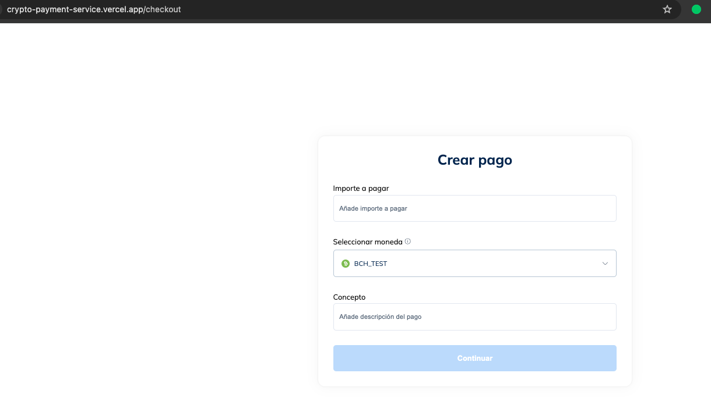

# Cryptocurrency payment gateway

- **Goal**: create a cryptocurrency payment gateway in a test environment
- **System functional requirement**
  - [x] Create payment order with a currency
  - [x] Confirm payment with
    - Smart QR (considering WebSocket)
    - <del>Web3</del>

## Tools

- Pages route with **Nextjs** (v14)
- UI with **React[TS]** + **CSS** Modules
- Store management with **Zustand**
- [Bitnovo API: Swagger](./doc/api.yaml) | [API specification](https://payments.pre-bnvo.com/redoc)

## Getting started

- Requirements
  - Nodejs (+v18)
  - NPM
- Execution

  ```bash
  git clone <repo-link>
  cd cryptocurrency-payment-gateway
  cp .env.example .env  # add secrets
  npm install
  npm run dev
  ```

## Local demo

- [Demo](./doc/demo.mkv)

## Production

<div align="center">
  <a href="https://crypto-payment-service.vercel.app" target="_blank">
    
  </a>
  <p>Make your payment with cryptocurrency.</p>
  <a href="https://crypto-payment-service.vercel.app"><strong>Explore the app »</strong></a>
</div>

## Notes

- Rendering mode: **CSR**
- Use of **Screaming architecture** based on features or business concept (instead of "file-based type": components, services,types, ...) where each feature will encapsulate different layers.
- Animation: after rendering component
- Exhaustive use of the <ins>generic</ins> types
- Applied following **patterns**: compound + hooks + render props
- In <ins>Dropdown</ins> applying the compound pattern can complicate communication between components because "select" and "options" are connected. If we want to give the freedom that the Dropdown can be modified from outside then it could be interesting.
  ```jsx
  <Select id="select"
    value={age} label="Age"
    onChange={handleChange}
  >
    <MenuItem value="">
      <em>None</em>
    </MenuItem>
    <ListSubheader>Category 1</ListSubheader>
    <MenuItem value={1}>Option 1</MenuItem>
    <MenuItem value={2}>Option 2</MenuItem>
  </Select>
  <NativeSelect
    defaultValue={30}
    inputProps={{
      name: 'age',
      id: 'uncontrolled-native',
    }}
  >
    <option aria-label="None" value="" />
    <optgroup label="Category 1">
      <option value={1}>Option 1</option>
      <option value={2}>Option 2</option>
    </optgroup>
    <optgroup label="Category 2">
      <option value={3}>Option 3</option>
      <option value={4}>Option 4</option>
    </optgroup>
  </NativeSelect>
  ```
- Generated **QR** image of a cryptocurrency wallet address
- Validated cryptocurrency wallet address (blockchain)
- Use of [web]**sockets**: two-way communication to track payment
  <p align='center'></p>

- <details><summary>Improvement tasks</summary>

  - Could group ui components that are related into directories: Inputs, Labels, Images, ...
  - Have not been able to add a scroll to the list of cryptos inside the Frame
  - There is a strange jump when navigate from */checkout* to */checkout/confirmation* (because of layout)
  - [Show 404](https://unsplash.com/es/error)
  - There is no way to make or create a fictitious payment with a cryptocurrency wallet, should be added.
  - Missing to add some wallet with web3: e.g. METAMASK
  - In search filter, an informative component could be displayed when no search results have been found.
  - Mobile version
    ```
    /* Tablet and smaller Desktop */
    @media (min-width: 701px) and (max-width: 1120px) { ... }
    ```
  </detail>
